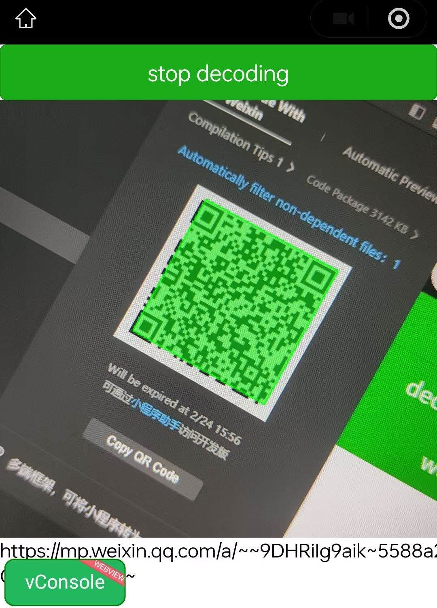

# dynamsoft barcode reader JS for wechat miniprogram

This project is developed based on dbrjs 11.2.5000.

## Fastest way to test in a real mobile

You can replace `appid` as your `test account` in `project.config.json` file. Then restart `WeChat Developer Tools` for the changes to take effect.

You can get your test account this way: WeChat Developer Tools => Login => Project => New Project => AppID => Test Account

## dynamsoft license

Note that the license is located in the `barcode-reader-sample/pages/test/index.js` file, under the variable `dbrLicense`.

Currently you can only use an offline license. 

## __noUseButToWorkaroundBabelError

In `app.js`, we put a function `__noUseButToWorkaroundBabelError`. Then we can use `async` in sub packages.

